# New Jersey Department of Transportation (DOT) Assessment

NJ DOT is a large organization with a variety of applications and services. The following is an assessment of the current state of the organization's IT infrastructure and applications.

Traffic data:

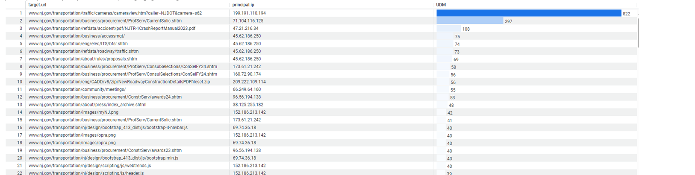

## Servers On Prem

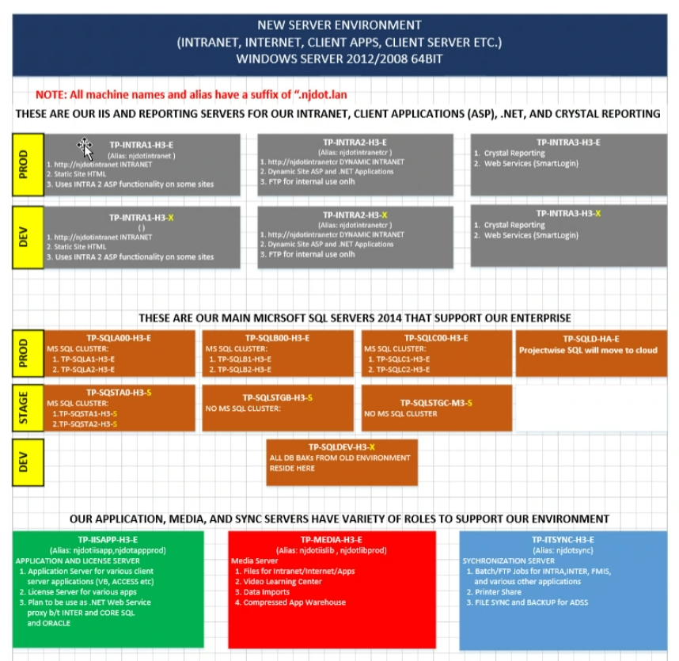

## Public website

Department exposure, explains what purpose of department is.

- Bootstrap
- HTML
- CSS
- JavaScript

A job runs overnight at interval to update the website with the latest information. The job is written in SQL Agent activeX and VBScript and PowerShell runs read database. The job then updates the website with the latest information injecting HTML and CSS.

Currently hosted in Azure for lower environments and PROD is on prem.

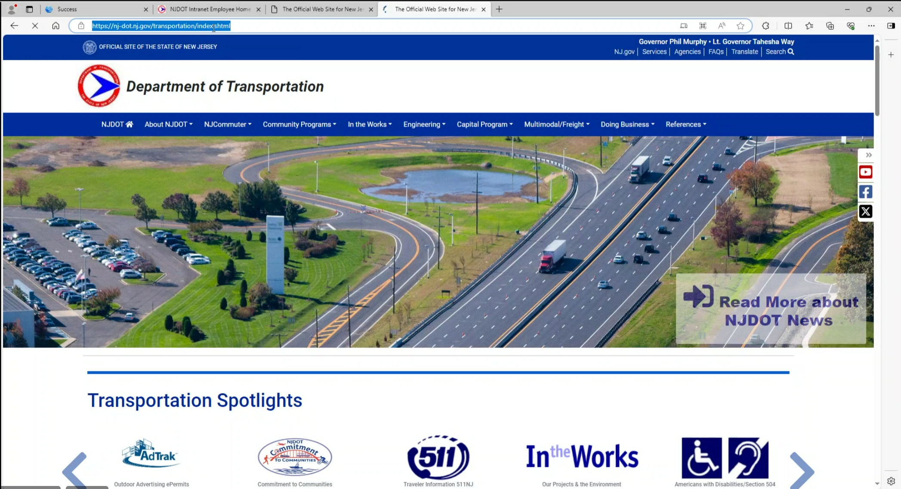

### Infrastructure

Cloud infranstructure is hosted on Virtual Machines with tight network.

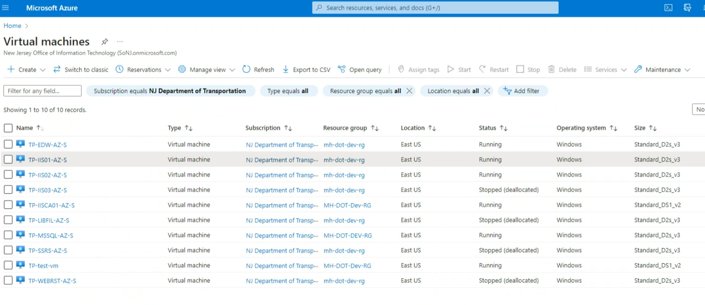

Naming convention:

- TP = Transportantion
- AZ = Azure
- S = Non-Prod
- E = Prod

They all share the same file share.

## Intranet website hosted on prem

Has access to series of aplications and services.

- HTML
- Bootstrap
- CSS
- JavaScript
- ASP Classic back end

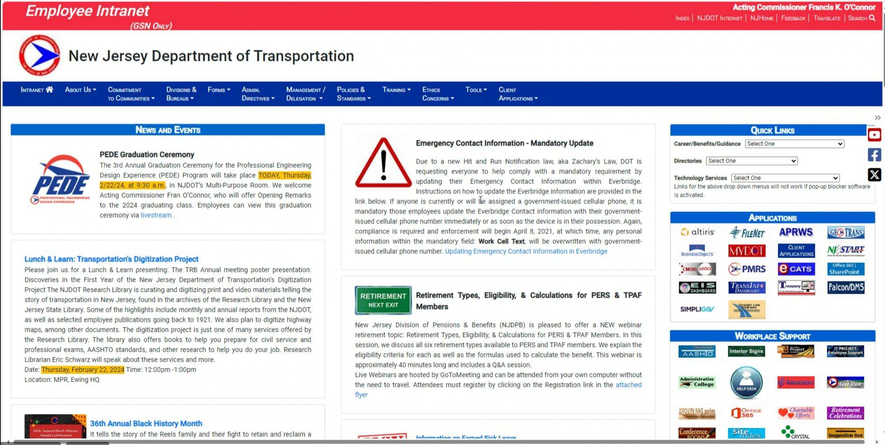

Has a login experience with usernames and password stored in a databases. Would like to move to Microsoft Entra SSO. Application keeps user state in database, so when I log in next time it knows where I was and takes me there.

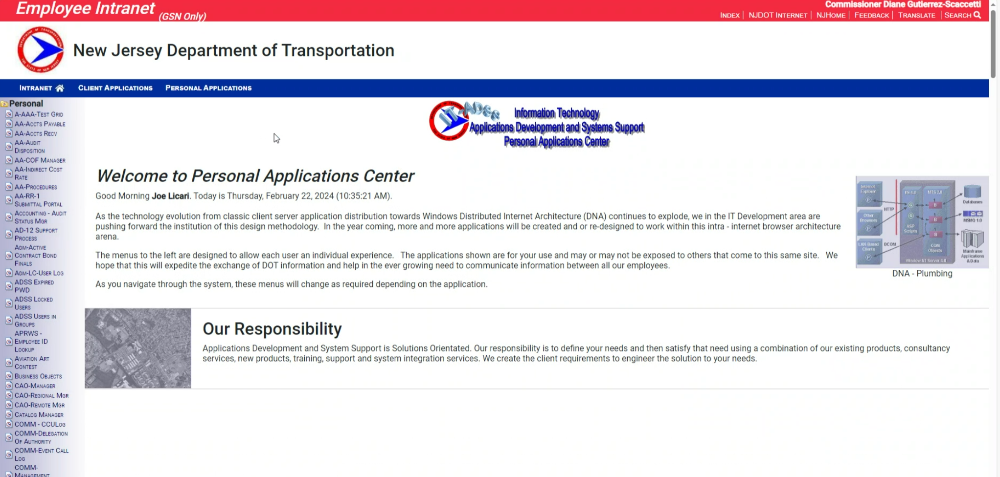

Has personalized information for each user. Each application is written in different technology: asp classic or .net framework. Some applications display a Crystal Report.

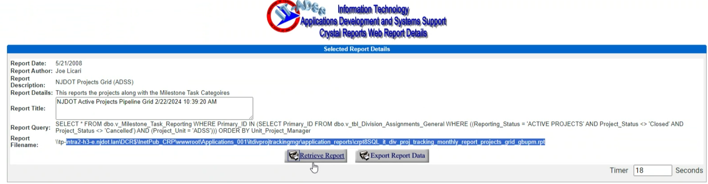

Crystal report page is written in .net framework version 4.5 aspx. Potentially move to PowerBI.

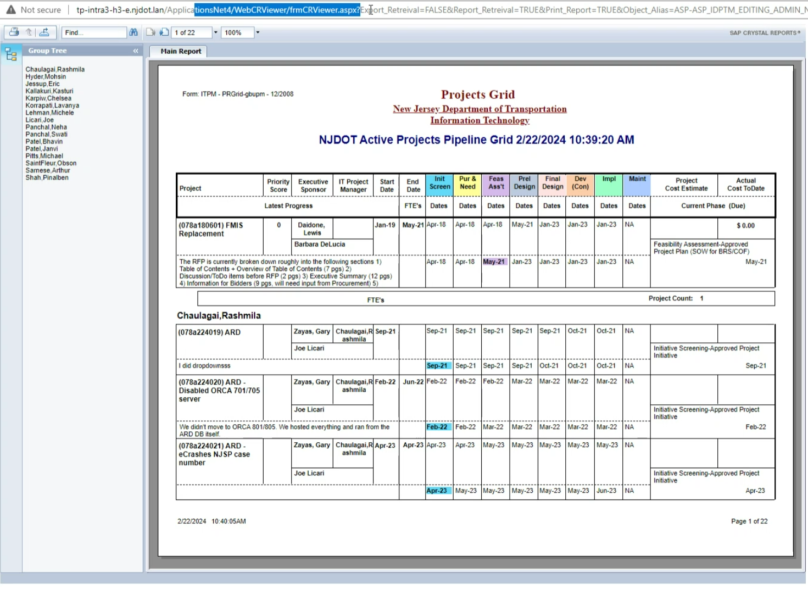

There are 5 COM+ components. Written in VB, still have source code, very old havent touched them in a while.

There is a version of it in C# done in WCF. This is utilized in reports.

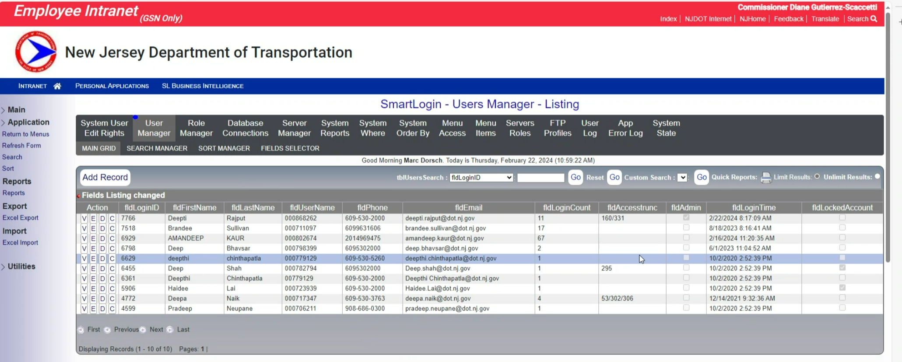

Sample report with chart plugin:

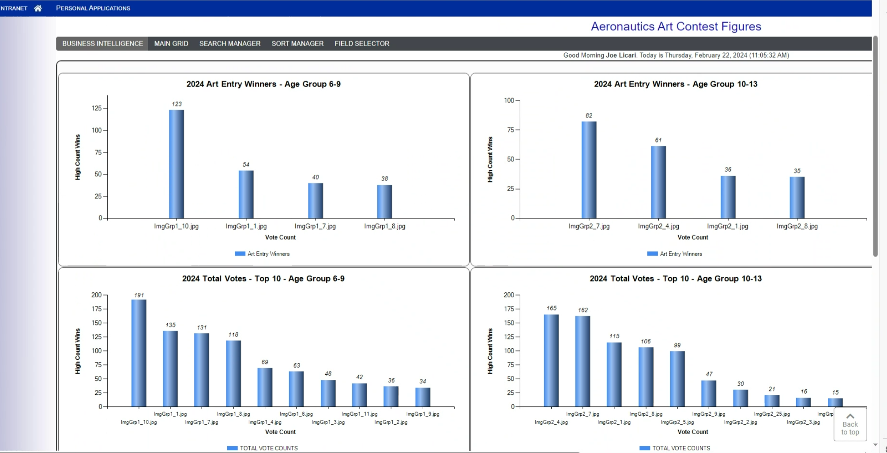

## Library Server

New documents are uploaded to library server via web page:

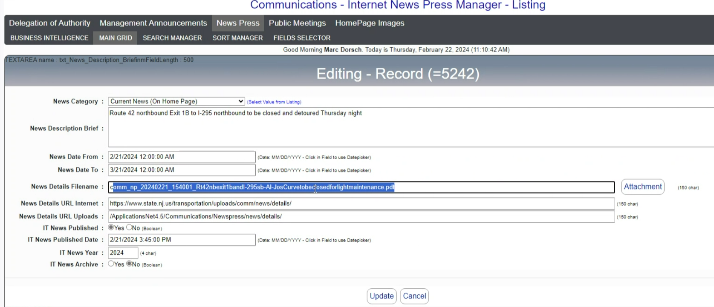

Those files are used in both intranet and internet sites for things like press releases, etc. in PDF format. It's a multi-step process that could be improved with dynamic site hitting an API instead. A SQL Stored Procedure is used to produce the dynamic HTML for the page. Then a sync job runs to update the website with the latest information.
